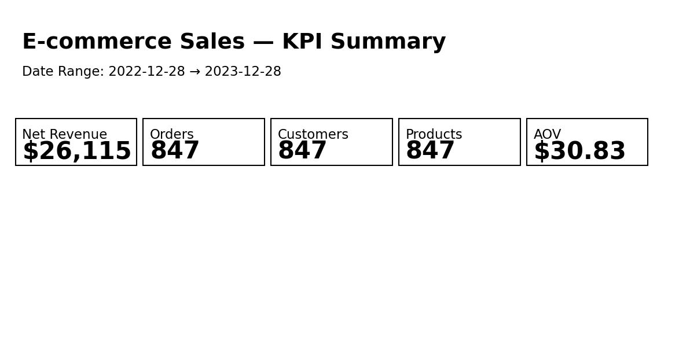
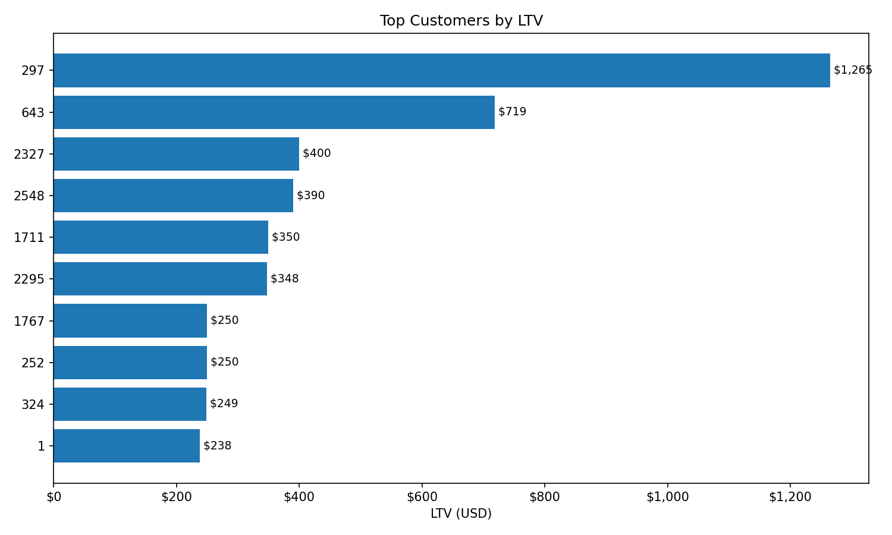
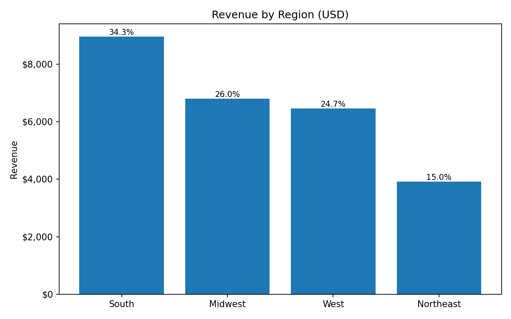
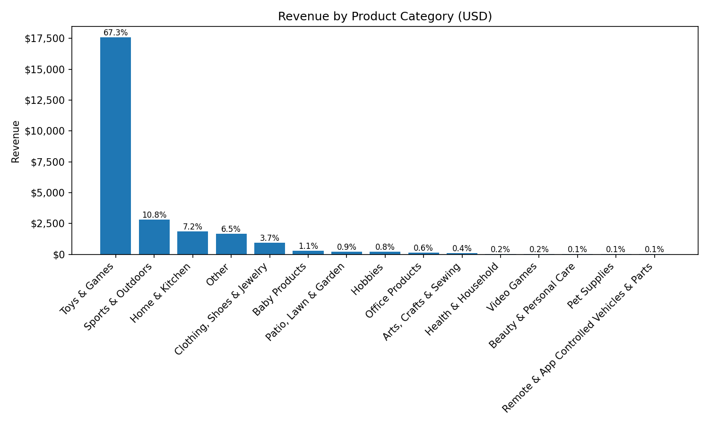
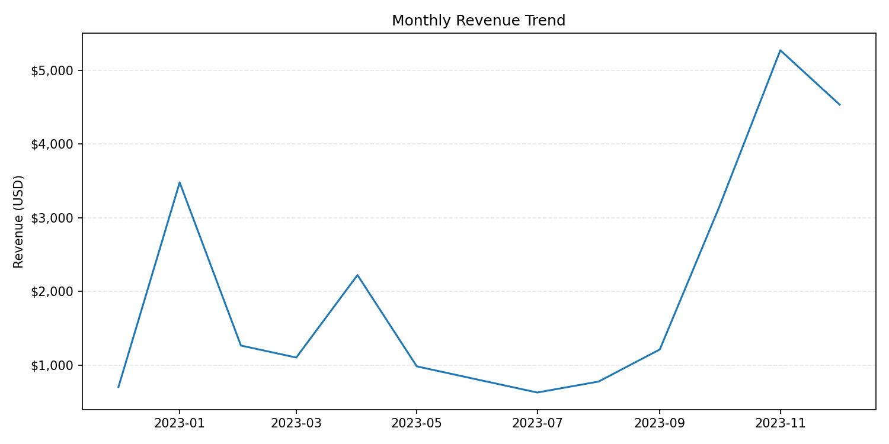
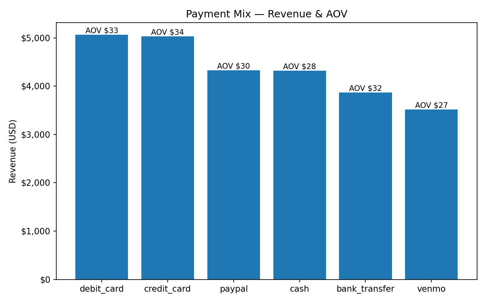

````markdown
# SQL E-commerce Analytics — Data Cleaning & Business Insights

**Business goal:** Turn messy e-commerce CSVs into a clean analytics model and produce **recruiter-ready insights**: top customers (LTV), revenue by category/region/season, payment mix, and new vs repeat.

---

## Overview
This repo shows the full analyst workflow:
**ingest → clean → model → measure (KPIs) → export → visualize → explain**.  
Everything runs locally via **Dockerized PostgreSQL** and plain SQL. Charts are generated with a tiny Python script; PNGs are embedded so a recruiter can skim the value without running code.

---

## Dataset
- **Files:** `data/customer_details.csv`, `data/product_details.csv`, `data/orders_2024.csv` *(all years in the file are included; not restricted to 2024)*  
- **Source (replace with your link):** _Add Kaggle/source URL here_  
- **Grain:** `core.fact_sales` = **purchase line** (customer × product × timestamp).  
- **Timezone:** Europe/London.

---

## Methods (What’s implemented)
- **Cleaning:** typed IDs; normalized gender/payment; parsed timestamps; robust **price extraction** from noisy text (takes the **first valid** `$1,234.56`-like token).  
- **Modeling:**  
  - **Staging:** `stg.stg_customers`, `stg.stg_products`, `stg.stg_orders`  
  - **Dimensions:** `core.dim_calendar` (dynamic min→max), `core.dim_region`, `core.dim_product`, `core.dim_customer`  
  - **Fact:** `core.fact_sales` (purchase line with `order_id`, `unit_price`, `net_revenue`, denormalized `region` & `payment_method`)  
- **KPIs / Views:** `core.v_kpi_headline`, `core.v_top_customers_ltv`, `core.v_sales_by_category`, `core.v_sales_by_region`, `core.v_seasonality_monthly`, `core.v_payment_mix`, `core.v_order_new_repeat`  
- **Data Quality:** `core.v_dq_summary` (counts, uniqueness, referential integrity, domain/temporal checks).

---

## How to Run (Complete, copy-paste)

> Prereqs: **Docker Desktop** (WSL2 on Windows), and **Python 3.9+** for charting.

1) **Create local env (no secrets committed)**
```bash
cp .env.example .env        # open .env and set POSTGRES_PASSWORD
````

2. **Start Postgres (from repo root)**

```bash
docker compose up -d db
```

3. **Build the pipeline (RAW → STG → DIM → FACT → KPIs)**

```bash
docker compose exec -T db psql -U postgres -d ecom -f /sql/00_run_all.psql
```

4. **Export KPI snapshots to CSVs (no volume mounts needed)**

```bash
docker compose exec -T db psql -U postgres -d ecom -f /sql/08_export_snapshots.sql
```

5. **Generate charts (PNG to `images/`)**

```bash
pip install pandas matplotlib
python scripts/make_charts.py
```

6. **(Optional) Sanity checks**

```bash
docker compose exec -T db psql -U postgres -d ecom -c "SELECT * FROM core.v_kpi_headline;"
docker compose exec -T db psql -U postgres -d ecom -c "SELECT * FROM core.v_dq_summary ORDER BY metric;"
```

---

## Visuals (Embedded)

> These PNGs live in `images/` and are created by `scripts/make_charts.py`.

* **KPI Summary**
  

* **Top Customers by LTV**
  

* **Revenue by Region**
  

* **Revenue by Product Category**
  

* **Monthly Revenue Trend**
  

* **Payment Mix (Revenue & AOV)**
  

* **New vs Repeat — Orders & Revenue Share**
  

---

## Results & Insights (Explain the charts)

> Replace the placeholders (`<…>`) with your actual numbers after running the exports.

### 1) Headline KPIs

* **Orders:** `<N_orders>` **Customers:** `<N_customers>` **Products:** `<N_products>`
* **Net Revenue:** `$<total_revenue>` **AOV:** `$<aov>` **Date Range:** `<min_date> → <max_date>`
* **So what:** AOV and total revenue set the benchmark for growth goals.

### 2) Top Customers by LTV

* **Top 10 LTV total:** `$<top10_ltv_sum>` which is `<top10_share>%` of revenue.
* **So what:** Invest in **VIP perks** and **post-purchase journeys** to lift repeat rate.

### 3) Revenue by Region

* **Leaders:** `<region_1>` `$<rev1>`, `<region_2>` `$<rev2>` …
* **So what:** Concentrate budget in winners; test **geo-targeted promos** to develop under-penetrated regions.

### 4) Revenue by Category

* **Top categories:** `<cat_1>` `$<rev1>` (`<share1>%`), `<cat_2>` `$<rev2>` …
* **So what:** Deepen **assortment/bundles** where demand is proven; prune long-tail items.

### 5) Monthly Seasonality

* **Peaks:** `<month_1>`, `<month_2>`; **troughs:** `<month_low>`.
* **So what:** Phase **inventory and campaigns** into peak months; mitigate slow periods with offers.

### 6) Payment Mix & AOV

* **Share:** `<method_1>` `<share1>%`, `<method_2>` `<share2>%` …; **AOV varies** by method.
* **So what:** Ensure top methods are frictionless; test **method-specific incentives** to raise AOV.


---

## Tools Used

* **Database:** PostgreSQL 16 (Docker Compose)
* **Language:** SQL (Postgres)
* **Visualization:** Python (`pandas`, `matplotlib`)
* **OS:** Windows/Mac/Linux

---

## Repository Structure

```
sql-ecommerce-analytics/
├── sql/
│   ├── 00_run_all.psql
│   ├── 01_schema_and_load.sql
│   ├── 02_cleaning_rules.sql
│   ├── 03_dimensions.sql
│   ├── 04_fact_sales.sql
│   ├── 05_kpi_views.sql
│   ├── 06_analysis_queries.sql
│   ├── 07_data_quality_checks.sql
│   └── 08_export_snapshots.sql
├── data/        # input CSVs
├── exports/     # generated CSVs
├── images/      # generated PNGs used in README
├── scripts/
│   └── make_charts.py
├── docker-compose.yml
├── .env.example
└── README.md
```

---

## Troubleshooting

* **CSV not found / path issues:** filenames must exactly match those referenced in `01_schema_and_load.sql`.
* **Windows volume quirks:** run compose from the repo root; prefer paths **without spaces**.
* **DB reset (compose `down -v`):** re-run `00_run_all.psql` before exporting/plotting.

---


